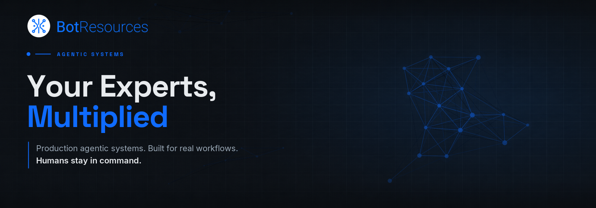

  

  <a href="https://botresources.ai/en/our-process">How we work</a>
  ·
  <a href="https://botresources.ai/en/stories">Stories</a>
  ·
  <a href="https://botresources.ai/en/careers">Careers</a>
  ·
  <a href="https://botresources.ai/en/contact">Contact</a>

## Agentic systems, not demos

Bot Resources is a French engineering company building agentic systems for
international clients.

We redesign real expert workflows, connect agents to the systems and
information they need, and keep people in command of consequential decisions.

- **Workflows before models** — we start with the work, not the technology.
- **Verification by design** — humans review what is faster to verify than produce.
- **Built for your reality** — existing infrastructure, data, constraints, and teams.
- **Measured before scaled** — usefulness and performance earn the next investment.
- **Ownership, not dependency** — your teams understand and own the resulting system.

## From use case to production

| Phase | Question | Outcome |
| --- | --- | --- |
| **0 · Scoping** | Are we solving the right problem together? | Clear use case and go/no-go |
| **1 · POC** | Can an agentic system perform the task? | Working prototype tested by users |
| **2 · POV** | Can it reach the performance required to create value? | Measured MVP and technical baseline |
| **3 · Industrialization** | Can it become robust, integrated, and sustainable? | Production system, documentation, and knowledge transfer |

[See our complete process →](https://botresources.ai/en/our-process)

## Building the future of AI-augmented work

We work across agent architecture, context engineering, workflow design,
applied AI research, backend systems, infrastructure, and product interfaces.

[See open roles →](https://botresources.ai/en/careers)

---

  <strong>Have an expert workflow worth multiplying?</strong> 
  <a href="https://botresources.ai/en/contact">Let’s find out if an agentic system is the right answer.</a>

